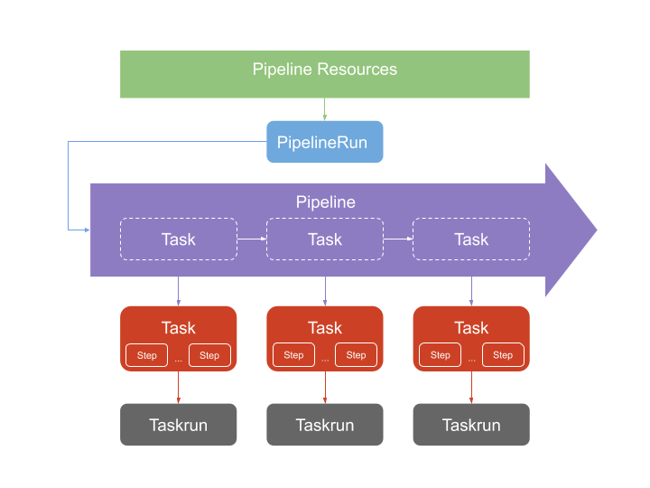

# Jenkins X and it's orchestration power

We may know Jenkins X as the new pure cloud native implementation of Jenkins. It is based on the use of Kubernetes Custom Resource Definitions (CRD's) to experience a seamless execution of CI/CD pipelines. This happens by leveraging the power of Kubernetes in terms of scalability, infrastructure abstraction and velocity.

The new main approach of Jenkins X is about to work on what we call a serverless experience, because there is no more traditional Jenkins engine running. So, it relies on a CI/CD serverles pipeline engine that can run on any standard Kubernetes deployment. This engine is the [Tekton CD project ](https://github.com/tektoncd/pipeline), a Google project that is part of the [Continuous Delivery Foundation](https://cd.foundation/).

In this post, we are showing the power of Tekton as a decoupled CI/CD pipeline engine execution. But more important, why an orchestration pipeline platform - like Jenkins X - is practically needed to design, configure and run your pipelines for the whole Delivery process.

## The Tekton base

Why then Tekton is a cool CI/CD engine?

First of all, Tekton is built on and for Kubernetes. This means that containers are the building blocks of any pipeline definition and execution, and Kubernetes orchestrates the container's magic. One step, one container. But it's more than that:
- Everything is decoupled, so for example, a group of steps, or any pipeline resource can be shared and reused through different pipeline executions
- Kubernetes is the platform, meaning that pipelines can be deployed and executed on any standard Kubernetes cluster.
- Sequential execution of tasks defines a pipeline. So creating a pipeline conceptually is as easy as defining the order of the tasks that we want to run and that may be already deployed in our Kubernetes cluster.
- Any task can be run by instantiating it from a `TaskRun` with desired parameter values. Because every previous task can be parametrized, reusing them is just a matter of calling the right task with a specific parameter. Again, decoupling and reusing.
- Pipelines usually consume different resources like code, containers, files, etc. So Tekton uses `PipelineResources` as inputs and outputs between tasks to execute the pipeline workflow. That means that pipeline resources can be shared between pipelines in a descriptive way.
- Every pipeline component is a CRD, so pipeline execution is a matter of containers orchestration, something that Kubernetes does really well and pretty fast. It is reliable, stable, scalable and performant

Let's try to understand Tekton pipelines decoupled architecture in the following diagram :


In terms of scalability, it's a nice way to isolate objects that can be reused easily, right?

## Decoupling CI/CD is good, but...

Tekton then is about the power of a decoupled CI/CD engine, which has many advantages. But no one said that defining decoupled CI/CD pipelines was an easy task. It can be complex from a conceptual point of view if you don't change the mindset. Traditionally, we've been defining pipelines as different stages with their current steps to be executed. So, everything is only about how to orchestrate stages as sequential or parallel tasks, configuring parameters or conditions into the pipeline. Let's say that CI/CD has a monolithic mindset to configure and define pipelines.

If we start designing reusable components, then the resources, the pipeline flow, the execution parametrization and then feeding all components back and forth... This can be messy and error prone till having the complete decoupled pipeline map configured.

## An orchestration engine to manage pipelines

Let's then think about three decoupling best practices for pipelines in containerized ecosystems:
- The CI/CD execution  must be flexible, reusable and decoupled.
- The pipeline orchestration must be manageable, understandable and easy to deploy.
- Resources configuration for pipeline components needs to be standardized and easy to manage.

CI/CD in not only about designing automation pipelines to deliver software. It is also about managing and providing all resources required for automation execution. In Kubernetes we will need to deal also with different objects like `Secrets`, `ServiceAccounts`, `PersistentVolumes`, `ConfigMaps`, `Ingress`, etc.

So, focusing only on CI/CD pipelines, resources management shouldn't be complicated as well as easy to configure.


## An example to understand Tekton and Jenkins X orchestration

We are going to use an example of building an application to see how to design and run CI/CD pipelines with Tekton. Then, we are taking the same application and see how Jenkins X pipelines, using Tekton, generate similar objects, but from a different focus. It will show how pipeline orchestration capabilities are applied to a decoupled CI/CD pipeline engine, no matter how I need to deal with platform or infrastructure resources.

To do that let's use a well known Spring Boot application like the [Spring Petclinic example](https://projects.spring.io/spring-petclinic/). And let's use a repo using traditional Jenkins pipeline to build the application, create a Docker container and deploy into Kubernetes cluster.

In my traditional Jenkins example I use two pipelines in fact that are automated using [CloudBees Core Cross Team Collaboration](https://go.cloudbees.com/docs/cloudbees-core/cloud-admin-guide/cross-team-collaboration/) features:
- [Repo with a Jenkins pipeline to build](https://github.com/dcanadillas/petclinic-kaniko) the app, the Docker container and push it into Docker Registry
- A simple [Jenkins pipeline repo to deploy](https://github.com/dcanadillas/petclinic-kaniko-deploy) the previous container published

In our case, we are using one pipeline to do the build and deploy. First with a "pure Tekton" pipeline definition, and later using Jenkins X serverles pipelines.

### The pure Tekton way

So let's try to configure and execute the pipeline from a pure Tekton pipeline point of view. That means:
- Creating [`PipelineResources`](https://github.com/tektoncd/pipeline/blob/master/docs/resources.md) that are going to be used by `Tasks`
- Defining and creating [`Tasks`](https://github.com/tektoncd/pipeline/blob/master/docs/tasks.md) that contains the steps to be executed in the `Pipeline`
- Defining and creating the [`Pipeline`](https://github.com/tektoncd/pipeline/blob/master/docs/pipelines.md) that orchestrates the execution of `Tasks` with `Resources`
- Creating the [`PipelineRun`](https://github.com/tektoncd/pipeline/blob/master/docs/pipelineruns.md)
- Installing required Kubernetes resources, like `Secrets`, `ServiceAccounts` or permissions, in order to execute required steps within right containers (e.g. secrets used by Kaniko builder)

I already created a [GitHub Repo](https://github.com/dcanadillas/petclinic-tekton) with all YAML files needed (except secrets, which are explained in the MD file). But let's go through them.

We can create a YAML file with all `Tasks` objects and the `Pipeline` definition. We can call this file `petclinic-pipeline.yaml`:

```yaml
apiVersion: tekton.dev/v1alpha1
kind: Task
metadata:
  name: build-maven
spec:
  inputs:
    resources:
      - name: workspace
        type: git
    params:
      - name: workingDir
        description: Working directory parameter
        default: /workspace/workspace
  outputs:
    resources:
      - name: workspace
        type: git
  steps:
    - name: maven-build
      image: gcr.io/cloud-builders/mvn:3.5.0-jdk-8
      workingDir: ${inputs.params.workingDir}
      command: ["mvn"]
      args:
        - "clean"
        - "install"
    - name: ls-target
      image: ubuntu
      command:
        - "ls"
      args:
        - "-la"
        - "/workspace/workspace/target"
---
apiVersion: tekton.dev/v1alpha1
kind: Task
metadata:
  name: build-kaniko
spec:
  inputs:
    resources:
      - name: workspace
        type: git
        targetPath: petclinic
    params:
      - name: workingDir
        description: Working directory parameter
        default: /workspace/petclinic
      - name: DockerFilePath
        decription: Path to DockerFile
        default: /workspace/petclinic/Dockerfile
  outputs:
    resources:
      - name: dockerImage
        type: image
  steps:
    - name: kaniko-build
      image: gcr.io/kaniko-project/executor:latest
      command:
        - /kaniko/executor
      args:
        - "--dockerfile=${inputs.params.DockerFilePath}"
        - "--context=${inputs.params.workingDir}"
        - "--destination=${outputs.resources.dockerImage.url}"
      env:
        - name: GOOGLE_APPLICATION_CREDENTIALS
          value: /secret/kaniko-secret.json
      volumeMounts:
        - name: kaniko-secret
          mountPath: /secret
  volumes:
    - name: kaniko-secret
      secret:
        secretName: emea-sa-secret
---
apiVersion: tekton.dev/v1alpha1
kind: Task
metadata:
  name: deploy-kubectl
spec:
  inputs:
    resources:
      - name: workspacedeploy
        type: git
    params:
      - name: workingDir
        description: Working directory parameter
        default: /workspace/workspacedeploy
      - name: deployFile
        description: Deployment file for app
        default: test-deploy.yaml
        # Just a parameter to check the depployment name, because one step will force redeploy
      - name: deploymentName
        description: The K8s deployment object name
        default: petclinic
  steps:
    - name: kubectl-clean
      image: gcr.io/cloud-builders/kubectl:latest
      workingDir: ${inputs.params.workingDir}
      command: ["/bin/bash"]
      args:
        - -c
        - MYDEPLOY=$(kubectl get deployments -l app=petclinic -o name | awk -F'/' '{print $2}');
        - if [ "$MYDEPLOY" = "${inputs.params.deploymentName}" ];
        - then kubectl delete deployment $MYDEPLOY;
        - fi
    - name: kubectl-deploy
      image: gcr.io/cloud-builders/kubectl:latest
      workingDir: ${inputs.params.workingDir}
      command: ["kubectl"]
      args:
        - apply
        - -f 
        - ${inputs.params.deployFile}
---
apiVersion: tekton.dev/v1alpha1
kind: Pipeline
metadata:
  name: petclinic-pipeline
spec:
  resources:
    - name: source-repo
      type: git
    - name: docker-container
      type: image
    - name: deploy-repo
      type: git
  tasks:
    - name: petclinic-maven
      taskRef:
        name: build-maven
      resources:
        inputs:
          - name: workspace
            resource: source-repo
        outputs:
          - name: workspace
            resource: source-repo
    - name: petclinic-kaniko
      taskRef:
        name: build-kaniko
      resources:
        inputs:
          - name: workspace
            resource: source-repo
            from: 
              - petclinic-maven
        outputs:
          - name: dockerImage
            resource: docker-container
    - name: petclinic-deploy
      taskRef:
        name: deploy-kubectl
      runAfter:
        - petclinic-kaniko
      resources:
        inputs:
          - name: workspacedeploy
            resource: deploy-repo
      params:
        - name: deployFile
          value: test-deploy-secret.yaml
```

Then we can define also a file `pipeline-resources.yaml` with all required `PipelineResources` objects needed:
```yaml
apiVersion: tekton.dev/v1alpha1
kind: PipelineResource
metadata:
  name: petclinic-git
spec:
  type: git
  params:
    - name: url
      value: https://github.com/dcanadillas/petclinic-kaniko.git
    # - name: revision
    #   value: master
---
apiVersion: tekton.dev/v1alpha1
kind: PipelineResource
metadata:
  name: petclinic-image
spec:
  type: image
  params:
    - name: url
      value: eu.gcr.io/emea-sa-demo/petclinic-kaniko:latest
---
apiVersion: tekton.dev/v1alpha1
kind: PipelineResource
metadata:
  name: petclinic-deploy
spec:
  type: git
  params:
    - name: url
      value: https://github.com/dcanadillas/petclinic-kaniko-deploy.git
```

We are using two GitHub repositories as inputs (one for the application and the other for deployment definitions and one `PipelineResource` for the container image to be built).

Next, let's define the `PipelineRun`, that executes and instantiate the pipeline in a file `petclinic-run.yaml`:

```yaml
apiVersion: tekton.dev/v1alpha1
kind: PipelineRun
metadata:
  name: petclinic-pipelinerun
spec:
  pipelineRef:
    name: petclinic-pipeline
  serviceAccount: 'default'
  serviceAccounts:
    - taskName: petclinic-deploy
      serviceAccount: tekton-deployment
  resources:
  - name: source-repo
    resourceRef:
      name: petclinic-git
  - name: docker-container
    resourceRef:
      name: petclinic-image
  - name: deploy-repo
    resourceRef:
      name: petclinic-deploy
```

In the `PipelineRun` object is important to understand that is intended in the way of defining the specific running instance of a deployed pipeline. So it's a perfect time to assign running input/output parameter values, specify `serviceAccounts` to be used, or referencing the right `PipelieResources` to be used.

Once we have the YAML definitions, it's only a matter of Kubernetes deployment of the Tekton CRD objects. So, to deploy them we can use `kubectl` command line tool:

```bash
$ kubectl apply -f petclinic-resources.yaml,petclinic-pipeline.yaml
```
``` 
pipelineresource.tekton.dev/petclinic-git created
pipelineresource.tekton.dev/petclinic-image created
pipelineresource.tekton.dev/petclinic-deploy created
task.tekton.dev/build-maven created
task.tekton.dev/build-kaniko created
task.tekton.dev/deploy-kubectl created
pipeline.tekton.dev/petclinic-pipeline created
```

We can see then the objects already deployed, as `CRDs` objects.

```bash
$ kubectl get tasks,pipelines,pipelineresources
```
```
NAME                             AGE
task.tekton.dev/build-kaniko     2s
task.tekton.dev/build-maven      2s
task.tekton.dev/deploy-kubectl   2s

NAME                                     AGE
pipeline.tekton.dev/petclinic-pipeline   2s

NAME                                           AGE
pipelineresource.tekton.dev/petclinic-deploy   2s
pipelineresource.tekton.dev/petclinic-git      2s
pipelineresource.tekton.dev/petclinic-image    2s
```

So we can check our pipeline to be executed:
```bash
$ kubectl describe pipeline.tekton.dev/petclinic-pipeline
```

```yaml
Name:         petclinic-pipeline
Namespace:    tekton-pipelines
Labels:       <none>
Annotations:  kubectl.kubernetes.io/last-applied-configuration:
                {"apiVersion":"tekton.dev/v1alpha1","kind":"Pipeline","metadata":{"annotations":{},"name":"petclinic-pipeline","namespace":"tekton-pipelin...}}
API Version:  tekton.dev/v1alpha1
Kind:         Pipeline
Metadata:
  Creation Timestamp:  2019-07-13T10:19:12Z
  Generation:          1
  Resource Version:    22835394
  Self Link:           /apis/tekton.dev/v1alpha1/namespaces/tekton-pipelines/pipelines/petclinic-pipeline
  UID:                 a8d4e6ca-a557-11e9-b2c9-42010a8400ab
Spec:
  Resources:
    Name:  source-repo
    Type:  git
    Name:  docker-container
    Type:  image
    Name:  deploy-repo
    Type:  git
  Tasks:
    Name:  petclinic-maven
    Resources:
      Inputs:
        Name:      workspace
        Resource:  source-repo
      Outputs:
        Name:      workspace
        Resource:  source-repo
    Task Ref:
      Name:  build-maven
    Name:    petclinic-kaniko
    Resources:
      Inputs:
        From:
          petclinic-maven
        Name:      workspace
        Resource:  source-repo
      Outputs:
        Name:      dockerImage
        Resource:  docker-container
    Task Ref:
      Name:  build-kaniko
    Name:    petclinic-deploy
    Params:
      Name:   deployFile
      Value:  test-deploy-secret.yaml
    Resources:
      Inputs:
        Name:      workspacedeploy
        Resource:  deploy-repo
    Run After:
      petclinic-kaniko
    Task Ref:
      Name:  deploy-kubectl
Events:      <none>
```

So we can see that the `Pipeline` object is going to execute in order the tasks already existing in K8s cluster: `build-maven`, `build-kaniko` and `deploy-kubectl`. And for that we are setting as inputs and outputs the different `PipelineResources` 

But, we are using some resources expected in the cluster that are not created at pipeline definition, like `Secrets` for pushing into private Docker Registry (GCR in my case), `ServiceAccount`, `Roles` and `RoleBindings` to deploy in Kubernetes with the specific permissions. I am not focusing on doing this at this post, but you can read how to do it in my [original repo documentation](https://github.com/dcanadillas/petclinic-tekton/blob/master/README.md#configuration-requirements).

Now, running the pipeline is just about deploying the `PipelineRun` definition in our `pipeline-run.yaml` file:

```bash
$ kubectl apply -f petclinic-run.yaml
```

A Tekton `CRD` is then created to run the pipeline.

```
pipelinerun.tekton.dev/petclinic-pipelinerun created
```
Different things are going to happen in this case:
- The `PipelineRun` is going to create a `TaskRun` per `Task`. Than means that every stage of the pipeline is going to be executed within the `Task` definition already deployed, depending on the `Pipeline` flow created
- Every `TaskRun` is going to be executed in a Kubernetes `Pod`, using inside the containers specified in the different `Steps` in the `Tasks`. Remember about Tekton: One step. One container.
- `PipelineResources` are just "consumed or produced" by `Tasks` depending on the parameters used during `TaskRuns` 
- Different `ServiceAccounts` are going to be used for `Tasks` depending on the definition of the `PipelineRun` (it makes sense that different roles are needed for different tasks)

So, if we take a look about our execution this is what happened after the complete run:

```bash
$ kubectl get pods

NAME                                                      READY   STATUS      RESTARTS   AGE
petclinic-6f668b59b5-w8zrr                                1/1     Running     0          21s
petclinic-pipelinerun-petclinic-deploy-54kws-pod-c5a511   0/3     Completed   0          1m
petclinic-pipelinerun-petclinic-kaniko-s4nnw-pod-67721d   0/4     Completed   0          1m
petclinic-pipelinerun-petclinic-maven-9gnpf-pod-fa757f    0/5     Completed   0          4m
tekton-pipelines-controller-6b565f9859-knqsb              1/1     Running     0          8h
tekton-pipelines-webhook-7f47c995cd-db2rv                 1/1     Running     0          8h
```
And we can check that `TaskRuns` where created
```bash
$ kubectl get taskruns

NAME                                           SUCCEEDED   REASON      STARTTIME   COMPLETIONTIME
petclinic-pipelinerun-petclinic-deploy-54kws   True        Succeeded   2h          2h
petclinic-pipelinerun-petclinic-kaniko-s4nnw   True        Succeeded   2h          2h
petclinic-pipelinerun-petclinic-maven-9gnpf    True        Succeeded   2h          2h
```
If we take a look to one of them we can see the execution status and completion:

```bash
$ kubectl describe taskrun/petclinic-pipelinerun-petclinic-kaniko-s4nnw

[...]

Status:
  Completion Time:  2019-07-15T18:13:25Z
  Conditions:
    Last Transition Time:  2019-07-15T18:13:25Z
    Message:               All Steps have completed executing
    Reason:                Succeeded
    Status:                True
    Type:                  Succeeded
  Pod Name:                petclinic-pipelinerun-petclinic-kaniko-s4nnw-pod-67721d
  Start Time:              2019-07-15T18:12:55Z
  Steps:
    Name:  kaniko-build
    Terminated:
      Container ID:  docker://f077cc23c848bb5a937201719543db01d8cfd2712dabfb577df4b02b8c32b704
      Exit Code:     0
      Finished At:   2019-07-15T18:13:24Z
      Reason:        Completed
      Started At:    2019-07-15T18:13:09Z
    Name:            image-digest-exporter-kaniko-build-ldh8q
    Terminated:
      Container ID:  docker://106f2819a96246761eed0486e2f66428dafb38cdff291c3004e9e75d9a245963
      Exit Code:     0
      Finished At:   2019-07-15T18:13:24Z
      Message:       []
      Reason:        Completed
      Started At:    2019-07-15T18:13:12Z
    Name:            create-dir-workspace-sgtdd
    Terminated:
      Container ID:  docker://f80a5a1da2898e78edcaf2110d0adb304131ff7f07a14b4e40ab8a03a9f69167
      Exit Code:     0
      Finished At:   2019-07-15T18:13:13Z
      Reason:        Completed
      Started At:    2019-07-15T18:13:06Z
    Name:            source-copy-workspace-8dmsp
    Terminated:
      Container ID:  docker://081e363b08f7fe1d8bd21efa36c670531a6cbc5debf09b2662d8b27340d9ad48
      Exit Code:     0
      Finished At:   2019-07-15T18:13:14Z
      Reason:        Completed
      Started At:    2019-07-15T18:13:06Z
Events:              <none>
```

We then confirmed that this kind of pipeline definition and execution in Kubernetes can be extremely powerful in terms of reusability and extensibility. Everything is about playing with Cloud Native resources to deal with CI/CD pipeline objects and executions.

But let's face it. This is not a very easy way of executing pipelines. Powerful, but complex from a conceptual pipeline design


### Playing with Jenkins X Serverless Pipelines

We can think about orchestrating the previous application pipeline with Tekton to simplify it's usage and make it "manageable". Jenkins X is a very good solution to do that, because:

- Jenkins X [buildpacks](https://jenkins-x.io/architecture/build-packs/) give you pre-set pipelines for your applications. You can then start with a prepared and curated conceptual design that is easy to manage.
- Jenkins X is not a pipeline engine, it's a CI/CD solution. So all resources like Git repos, users, `ServiceAccounts`, environment `namespaces`, `ingress rules`, Docker Registry credentials, etc. are already configured to be able to orchestrate pipeline execution
- Configuring or extending pipeline definitions is just a matter of defining the flow of stages with their steps/containers to be executed. And Tekton is used automatically to decouple run definition and execution. Monolithic abstraction, decoupled execution. 
- [Jenkins X Pipelines](https://jenkins-x.io/architecture/jenkins-x-pipelines/) simplify any pipeline process to develop features, release or promote/deploy your code through environment.


To understand what we mean about Tekton orchestration, let's try to simulate the same specific tasks and steps defining a Jenkins X serverless pipeline without using buildpacks.

NOTE: This is not yet the standard way to work with Jenkins X, but using a standalone `jenkins-x.yml` pipeline we can show the relation of Tekton objects created and orchestrated automatically by Jenkins X.

Jenkins X cluster creation and installation it's just a matter of minutes. So, to start executing pipelines we'll start to deploy a Jenkins X cluster from scracth in GKE afeter [installing the Jenkins X CLI](https://jenkins-x.io/getting-started/install/) (showing parameters instead of values):

```bash
jx create cluster gke \
--cluster-name ${JX_CLUSTER} \
--default-admin-password ${MYPWD} \
--environment-git-owner ${GH_ORG} \
--min-num-nodes 3 --max-num-nodes 5 \
--machine-type n1-standard-2 \
--project-id ${GCP_PROJECT} --zone europe-west1-c \
--default-environment-prefix ${JX_CLUSTER} \
--git-provider-kind github \
--git-username ${GH_USER} \
--git-api-token ${GH_APITOKEN} \
--tekton \
--no-tiller \
-b
```
Once having the Jenkins X installation (serverless mode), you can check that Tekton `CRDs` are already there:

```bash
$ kubectl get crd

NAME                                           CREATED AT
[...]
pipelineresources.tekton.dev                   2019-07-10T11:38:50Z
pipelineruns.tekton.dev                        2019-07-10T11:38:50Z
pipelines.tekton.dev                           2019-07-10T11:38:50Z
[...]
taskruns.tekton.dev                            2019-07-10T11:38:50Z
tasks.tekton.dev                               2019-07-10T11:38:50Z
[...]
```

Right now, let's try to simulate the Tekton pipeline that we executed with a pure "standalone" Jenkins X YAML pipeline. This means that we are not using any `Build Packs`. For this, let's create the following `jenkins-x.yml` (we are removing the deployment check step  of `kubectl` on purpose):

```yaml
buildPack: none
pipelineConfig:
  pipelines:
    release:
      pipeline:
        # replace: true
        stages:
          - name: Maven Build
            agent:
              image: maven
            steps:
              - command: mvn
                args:
                  - clean
                  - install
          - name: Kaniko Build
            agent:
              image: gcr.io/kaniko-project/executor:latest
            # environment:
            #   - name: GOOGLE_APPLICATION_CREDENTIALS
            #     valueFrom:
            #       secretKeyRef:
            #         name: kaniko-secret
            #         key: kaniko-secret
            steps:
              - command: /kaniko/executor
                args:
                  - "--dockerfile=Dockerfile"
                  - "--context=/workspace/source"
                  - "--destination=eu.gcr.io/emea-sa-demo/petclinic-kaniko:latest"
          - name: Kubectl Deploy 
            agent:
              image: gcr.io/cloud-builders/kubectl:latest
            steps:
              - command: kubectl
                args:
                  - apply
                  - -f
                  - https://github.com/dcanadillas/petclinic-kaniko-deploy/blob/master/test-deploy.yaml?raw=true
                  - -n
                  - jx-staging

```
If we clone the same [petclinic-kaniko repo](https://github.com/dcanadillas/petclinic-kaniko) into our local directory we can do the following (working from local):

- Deleting any Git repo reference from the local cloned directory with `rm -r ./git` so we are working for sure from a local copy
- Include the previous `jenkins-x.yml` file that simulates de `maven-build` and `kaniko-build` tasks from our previous Tekton example
- Import the project with Jenkins X from the local directory:
  ```bash
  $ jx import --git-username dcanadillas --org jx-dcanadillas -m YAML

  ? Git user name: dcanadillas
  The directory /Users/david/Documents/Workspace/Technologists/petclinic-kaniko is not yet using git
  ? Would you like to initialise git now? Yes
  ? Commit message:  Initial import
  [...]
  ? Using organisation: jx-dcanadillas
  ? Enter the new repository name:  petclinic-jenkins-x
  [...]
  ```

The first pipeline execution is automatically run, so we can check the status of the execution by:
```bash
$ jx get activity -f petclinic -w

jx-dcanadillas/petclinic-jenkins-x/master #2                   4m24s    4m17s Succeeded
  Maven Build                                                  4m24s    2m10s Succeeded
    Credential Initializer 8xhk4                               4m24s       0s Succeeded
    Working Dir Initializer 7c8l2                              4m23s       0s Succeeded
    Place Tools                                                4m22s       0s Succeeded
    Git Source Jx Dcanadillas Petclinic Jenkin Rhg88 Jhl       4m21s       2s Succeeded https://github.com/jx-dcanadillas/petclinic-jenkins-x
    Git Merge                                                  4m20s       2s Succeeded
    Step2                                                      4m20s     2m5s Succeeded
    Source Mkdir Jx Dcanadillas Petclinic Jenkin Rhg88 K       4m20s     2m6s Succeeded
    Source Copy Jx Dcanadillas Petclinic Jenkin Rhg88 Z2       4m20s     2m6s Succeeded
  Kaniko Build                                                 1m38s      15s Succeeded
    Credential Initializer Lpcwz                               1m38s       0s Succeeded
    Working Dir Initializer Ww5lp                              1m37s       0s Succeeded
    Place Tools                                                1m36s       0s Succeeded
    Create Dir Workspace Zvlmw                                 1m35s       0s Succeeded
    Source Copy Workspace P5n28                                1m35s       2s Succeeded
    Step2                                                      1m34s      10s Succeeded
    Source Mkdir Jx Dcanadillas Petclinic Jenkin Rhg88 R       1m34s      10s Succeeded
    Source Copy Jx Dcanadillas Petclinic Jenkin Rhg88 Rg       1m33s      10s Succeeded
  Kubectl Deploy                                                1m5s      58s Succeeded
    Credential Initializer Hrmkx                                1m5s       0s Succeeded
    Working Dir Initializer Wgqh9                               1m4s       0s Succeeded
    Place Tools                                                 1m3s       0s Succeeded
    Create Dir Workspace J9wgg                                  1m2s       0s Succeeded
    Source Copy Workspace K8nz4                                 1m1s       1s Succeeded
    Step2                                                         9s       2s Succeeded
```


```bash
$ kubectl get tasks,tasks,taskruns,pipeline,pipelineruns

NAME                                                                      AGE
task.tekton.dev/jx-dcanadillas-petclinic-jenkin-rhg88-kaniko-build-2      7m
task.tekton.dev/jx-dcanadillas-petclinic-jenkin-rhg88-kubectl-deploy-2    7m
task.tekton.dev/jx-dcanadillas-petclinic-jenkin-rhg88-maven-build-2       7m

NAME                                                                               AGE
taskrun.tekton.dev/jx-dcanadillas-petclinic-jenkin-rhg88-2-kaniko-build-kpk8v      4m
taskrun.tekton.dev/jx-dcanadillas-petclinic-jenkin-rhg88-2-kubectl-deploy-scs4r    4m
taskrun.tekton.dev/jx-dcanadillas-petclinic-jenkin-rhg88-2-maven-build-d42f4       7m

NAME                                                          AGE
pipeline.tekton.dev/jx-dcanadillas-petclinic-jenkin-rhg88-2   7m

NAME                                                             AGE
pipelinerun.tekton.dev/jx-dcanadillas-petclinic-jenkin-rhg88-2   7m
```


Checking exactly the same pods used (one pod per Tekton task):

```bash
$ kubectl get pod -n jx
NAME                                                                      READY   STATUS      RESTARTS   AGE
crier-749f96fb4d-qv4jj                                                    1/1     Running     0          5d10h
deck-696f77d746-2xr69                                                     1/1     Running     0          5d10h
[...]
jx-dcanadillas-petclinic-jenkin-rhg88-2-kaniko-build-kpk8v-pod-4dd505     0/6     Completed   0          3m41s
jx-dcanadillas-petclinic-jenkin-rhg88-2-kubectl-deploy-scs4r-pod-a2f48a   0/4     Completed   0          2m52s
jx-dcanadillas-petclinic-jenkin-rhg88-2-maven-build-d42f4-pod-432bb5      0/6     Completed   0          6m14s
[...]                                              1/1     Running     0          5d10h
tekton-pipelines-controller-687cfbcc89-69jht                              1/1     Running     0          5d10h
tekton-pipelines-webhook-7fd7f8cdcc-pqv4c                                 1/1     Running     0          5d10h
tide-5f8fb5964c-29pgt                                                     1/1     Running     0          5d10h
```


### The pure Jenkins X way


## Some thoughts and conclusions


